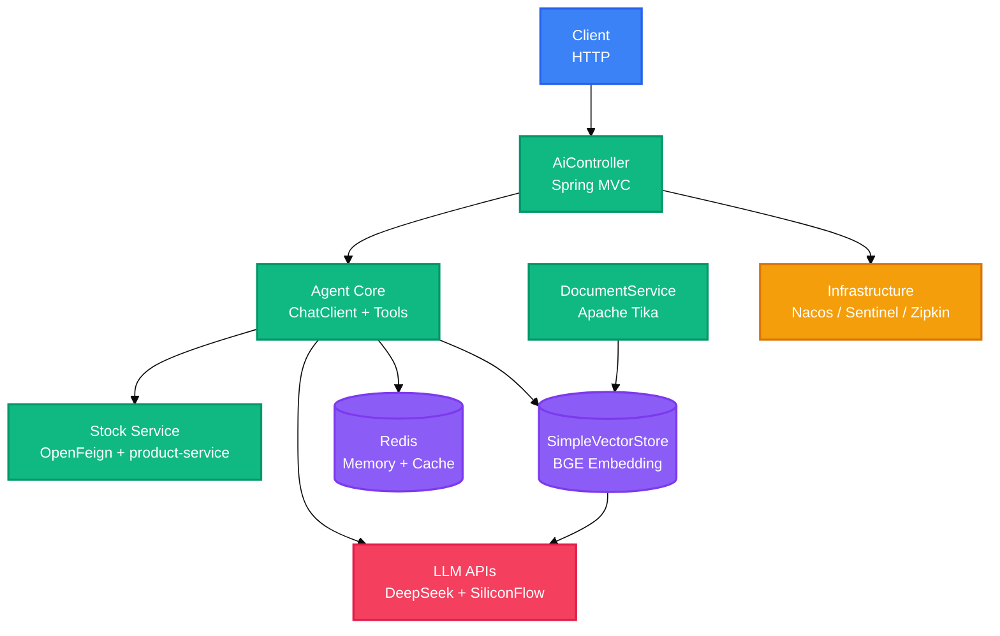

<div align="right">

[English](README.md) · 中文

</div>

<h1 align="center">AgentTest</h1>

<p align="center">
  <strong>基于 Spring AI 的秒杀业务问答 Agent 服务。</strong>
  <br />
  <em>工具调用 · RAG 检索 · 会话记忆 · Java 17</em>
</p>

<p align="center">
  <a href="#快速开始"></a>
</p>

<p align="center">
  
  
  
  
  
  
</p>

## 功能特性

| 功能 | 说明 |
|---|---|
| 工具调用 | `queryStock`、`queryProduct`、`queryPrice` 通过 Spring AI 工具暴露，并经 OpenFeign 从 `product-service` 获取实时数据。 |
| RAG 问答 | 启动时加载 `src/main/resources/documents` 下的文档，向量检索使用 `topK=3`。 |
| 会话记忆 | Redis 按用户保留最近 10 轮对话，过期时间为 30 分钟。 |
| 响应缓存 | 相同工具问题以 MD5 生成的 Redis key 缓存一天。 |
| 结构化输出 | 模型回复会被解析为 `product_list`、`price` 或 `text` 的 JSON，解析失败时返回原始文本兜底。 |
| 运行控制 | Sentinel 将 `/ai/agent/chat` 限制为 10 QPS，Nacos 负责服务发现，Zipkin 以全量采样记录链路。 |

## 快速开始

### 环境要求

- JDK 17
- Redis 位于 `127.0.0.1:6379`
- Nacos 位于 `127.0.0.1:8848`
- DeepSeek 与 SiliconFlow API Key

### 修改配置

打开 `src/main/resources/application.properties`，将 `spring.ai.openai.api-key`、`siliconflow.api-key` 和 `spring.ai.openai.chat.api-key` 替换为自己的 Key。

### 启动

```bash
./mvnw clean package
java -jar target/test-0.0.1-SNAPSHOT.jar
```

Docker 方式：

```bash
./mvnw clean package
docker build -f DockerFile -t agent-test .
docker run -p 8086:8086 agent-test
```

### 验证

```bash
curl http://localhost:8086/actuator/health
```

## 使用示例

### 统一对话

`POST /ai/chat` 会根据关键词把消息路由到工具调用或普通对话。

```bash
curl -X POST http://localhost:8086/ai/chat \
  -H "Content-Type: application/json" \
  -d '{"message": "查一下库存", "userId": "user-001"}'
```

### RAG 问答

```bash
curl -X POST http://localhost:8086/ai/rag/chat \
  -H "Content-Type: application/json" \
  -d '{"message": "秒杀规则是什么"}'
```

### 结构化输出

```bash
curl -X POST http://localhost:8086/ai/agent/structured \
  -H "Content-Type: application/json" \
  -d '{"message": "有什么商品"}'
```

### 工具自动编排

```bash
curl -X POST http://localhost:8086/ai/agent/orchestrate \
  -H "Content-Type: application/json" \
  -d '{"message": "耳机多少钱"}'
```

## 系统架构

该服务是一个单体的 Spring Boot 应用，组合了 Spring AI 工具调用、向量库和 Redis 会话记忆。



`/ai/agent/chat` 的异步工具执行流程如下。

```mermaid
%%{init: {'theme': 'base', 'themeVariables': {'fontSize': '14px'}}}%%
sequenceDiagram
    participant C as Client
    participant A as AiController
    participant R as Redis
    participant E as aiExecutor
    participant AI as ChatClient
    participant T as AgentToolService
    participant S as product-service

    C->>A: POST /ai/agent/chat
    A->>R: GET agent:chat:{md5(message)}
    alt Cache hit
        R-->>A: cached answer
        A-->>C: Result.success
    else Cache miss
        A->>E: CompletableFuture.supplyAsync
        E->>AI: prompt().tools(agentToolService)
        AI->>T: queryStock / queryProduct / queryPrice
        T->>S: OpenFeign request
        S-->>T: product data
        T-->>AI: tool result
        AI-->>E: answer
        E->>R: SET answer (1 day TTL)
        E-->>A: Result.success
        A-->>C: answer
    end

    classDef client fill:#3B82F6,stroke:#2563EB,color:#fff
    classDef gateway fill:#F59E0B,stroke:#D97706,color:#fff
    classDef service fill:#10B981,stroke:#059669,color:#fff
    classDef data fill:#8B5CF6,stroke:#7C3AED,color:#fff

    class C client
    class A gateway
    class E,AI,T,S service
    class R data
```

## 配置

主要配置位于 `src/main/resources/application.properties`。

| 配置项 | 说明 | 默认值 |
|---|---|---|
| `server.port` | HTTP 端口 | `8086` |
| `spring.ai.openai.base-url` | 兼容 SiliconFlow 的嵌入接口地址 | `https://api.siliconflow.cn/v1` |
| `spring.ai.openai.api-key` | SiliconFlow API Key | `<your-key>` |
| `siliconflow.api-key` | 向量库使用的 SiliconFlow Key | `<your-key>` |
| `spring.ai.openai.chat.base-url` | 对话模型接口地址 | `https://api.deepseek.com` |
| `spring.ai.openai.chat.api-key` | DeepSeek API Key | `<your-key>` |
| `spring.ai.openai.chat.options.model` | 对话模型 | `deepseek-v4-pro` |
| `spring.ai.openai.embedding.options.model` | 嵌入模型 | `BAAI/bge-large-zh-v1.5` |
| `spring.cloud.nacos.discovery.server-addr` | Nacos 服务地址 | `127.0.0.1:8848` |
| `spring.data.redis.host` / `port` | Redis 连接地址 | `127.0.0.1` / `6379` |
| `spring.cloud.sentinel.transport.dashboard` | Sentinel 控制台 | `localhost:8858` |
| `management.zipkin.tracing.endpoint` | Zipkin 上报地址 | `http://localhost:9411/api/v2/spans` |
| `agent.prompts.structured` | 结构化输出系统提示词 | 内置 JSON 模板 |
| `agent.prompts.rag` | 带 `%s` 占位符的 RAG 提示词 | 内置模板 |
| `agent.prompts.orchestrate` | 带 `%s` 占位符的编排提示词 | 内置模板 |

## API

应用接口统一位于 `/ai` 下，控制器未强制鉴权。

| 方法 | 路径 | 说明 |
|---|---|---|
| GET | `/ai/chat` | 带 Redis 会话记忆的对话（`message`、`userId` 查询参数） |
| POST | `/ai/chat` | 统一对话；根据关键词路由到工具调用 |
| POST | `/ai/rag/chat` | 基于向量库检索的 RAG 问答 |
| GET | `/ai/stock/{productId}` | 通过 Feign 客户端读取库存 |
| POST | `/ai/agent/chat` | 异步工具对话，响应缓存一天 |
| POST | `/ai/agent/structured` | 对话并返回结构化 JSON |
| POST | `/ai/agent/orchestrate` | 执行模型请求的工具并汇总最终回答 |
| GET | `/actuator/health` | 健康检查（Actuator） |
| GET | `/actuator/info` | 应用信息（Actuator） |

## 项目结构

```
test/
├── pom.xml
├── DockerFile
├── mvnw / mvnw.cmd
├── src/main/java/Agent/AgentTest/
│   ├── Config/          # 提示词、线程池、向量库
│   ├── Controller/      # /ai REST 接口
│   ├── Dto/             # 请求与响应模型
│   ├── Exception/       # 全局异常处理
│   ├── Feign/           # product-service 客户端
│   ├── Service/         # 工具、记忆、文档加载
│   └── Util/            # JWT 工具
└── src/main/resources/
    ├── application.properties
    └── documents/test.txt
```

## 技术栈

### 后端

| 技术 | 用途 |
|---|---|
| Java 17 | 运行环境 |
| Spring Boot 3.5.0 | 应用框架 |
| Spring AI 1.1.7 | Chat 客户端、工具调用、向量库 |
| Maven | 构建与依赖管理 |

### AI

| 技术 | 用途 |
|---|---|
| DeepSeek API | 通过 OpenAI 兼容客户端调用对话模型 |
| SiliconFlow API | 使用 `BAAI/bge-large-zh-v1.5` 生成向量 |
| SimpleVectorStore | 内存向量库 |
| Apache Tika | 文档文本抽取 |

### 基础设施

| 技术 | 用途 |
|---|---|
| Redis | 会话记忆与响应缓存 |
| Nacos | 服务发现 |
| OpenFeign | 调用 `product-service` |
| Sentinel | QPS 限流 |
| Zipkin + Brave | 分布式链路追踪 |
| Spring Boot Actuator | 健康检查与信息端点 |

## 部署

### Docker

```bash
./mvnw clean package
docker build -f DockerFile -t agent-test .
docker run -p 8086:8086 agent-test
```

镜像基于 `openjdk:17-jdk-slim`，暴露端口 `8086`。容器需要能访问 Redis、Nacos、DeepSeek 和 SiliconFlow。

## 贡献指南

1. Fork 仓库
2. 创建功能分支（`git checkout -b feature/your-feature`）
3. 提交修改（`git commit -m 'feat: add your feature'`）
4. 推送分支（`git push origin feature/your-feature`）
5. 提交 Pull Request

---

未检测到 LICENSE 文件。建议添加 LICENSE 以明确项目授权。

<!-- BEAUTIFIED -->
