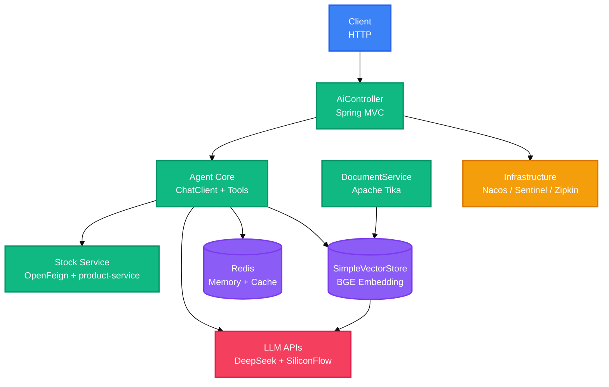

<div align="right">

[English](README.md) · [中文](README-zh.md)

</div>

<h1 align="center">AgentTest</h1>

<p align="center">
  <strong>Spring AI agent service that answers seckill business questions.</strong>
  <br />
  <em>Tool calling · RAG · Session memory · Java 17</em>
</p>

<p align="center">
  <a href="#quick-start"></a>
</p>

<p align="center">
  
  
  
  
  
  
</p>

## Features

| Feature | Description |
|---|---|
| Tool calling | `queryStock`, `queryProduct`, and `queryPrice` run through Spring AI tools and fetch live data from `product-service` via OpenFeign. |
| RAG answers | Documents under `src/main/resources/documents` are loaded at startup, embedded, and searched with `topK=3`. |
| Session memory | Redis keeps the latest 10 turns per user with a 30-minute TTL. |
| Response cache | Tool questions are cached for one day under an MD5-derived Redis key. |
| Structured output | Model responses are parsed into `product_list`, `price`, or `text` JSON, with a fallback for unparseable output. |
| Runtime controls | Sentinel limits `/ai/agent/chat` to 10 QPS, Nacos handles discovery, and Zipkin traces requests at full sampling. |

## Quick Start

### Prerequisites

- JDK 17
- Redis at `127.0.0.1:6379`
- Nacos at `127.0.0.1:8848`
- API keys for DeepSeek and SiliconFlow

### Configure

Open `src/main/resources/application.properties` and replace the API keys for `spring.ai.openai.api-key`, `siliconflow.api-key`, and `spring.ai.openai.chat.api-key` with your own values.

### Run

```bash
./mvnw clean package
java -jar target/test-0.0.1-SNAPSHOT.jar
```

Docker alternative:

```bash
./mvnw clean package
docker build -f DockerFile -t agent-test .
docker run -p 8086:8086 agent-test
```

### Verify

```bash
curl http://localhost:8086/actuator/health
```

## Usage

### Unified Chat

The `POST /ai/chat` endpoint routes messages to tool calling or normal chat based on keywords.

```bash
curl -X POST http://localhost:8086/ai/chat \
  -H "Content-Type: application/json" \
  -d '{"message": "查一下库存", "userId": "user-001"}'
```

### RAG Chat

```bash
curl -X POST http://localhost:8086/ai/rag/chat \
  -H "Content-Type: application/json" \
  -d '{"message": "秒杀规则是什么"}'
```

### Structured Output

```bash
curl -X POST http://localhost:8086/ai/agent/structured \
  -H "Content-Type: application/json" \
  -d '{"message": "有什么商品"}'
```

### Tool Orchestration

```bash
curl -X POST http://localhost:8086/ai/agent/orchestrate \
  -H "Content-Type: application/json" \
  -d '{"message": "耳机多少钱"}'
```

## Architecture

The service is a single Spring Boot application that combines Spring AI tools, a vector store, and Redis-backed memory.



The `/ai/agent/chat` flow shows the async tool execution path.

```mermaid
%%{init: {'theme': 'base', 'themeVariables': {'fontSize': '14px'}}}%%
sequenceDiagram
    participant C as Client
    participant A as AiController
    participant R as Redis
    participant E as aiExecutor
    participant AI as ChatClient
    participant T as AgentToolService
    participant S as product-service

    C->>A: POST /ai/agent/chat
    A->>R: GET agent:chat:{md5(message)}
    alt Cache hit
        R-->>A: cached answer
        A-->>C: Result.success
    else Cache miss
        A->>E: CompletableFuture.supplyAsync
        E->>AI: prompt().tools(agentToolService)
        AI->>T: queryStock / queryProduct / queryPrice
        T->>S: OpenFeign request
        S-->>T: product data
        T-->>AI: tool result
        AI-->>E: answer
        E->>R: SET answer (1 day TTL)
        E-->>A: Result.success
        A-->>C: answer
    end

    classDef client fill:#3B82F6,stroke:#2563EB,color:#fff
    classDef gateway fill:#F59E0B,stroke:#D97706,color:#fff
    classDef service fill:#10B981,stroke:#059669,color:#fff
    classDef data fill:#8B5CF6,stroke:#7C3AED,color:#fff

    class C client
    class A gateway
    class E,AI,T,S service
    class R data
```

## Configuration

Key settings live in `src/main/resources/application.properties`.

| Key | Description | Default |
|---|---|---|
| `server.port` | HTTP port | `8086` |
| `spring.ai.openai.base-url` | SiliconFlow-compatible embedding endpoint | `https://api.siliconflow.cn/v1` |
| `spring.ai.openai.api-key` | SiliconFlow API key | `<your-key>` |
| `siliconflow.api-key` | SiliconFlow key used by the vector store | `<your-key>` |
| `spring.ai.openai.chat.base-url` | Chat model endpoint | `https://api.deepseek.com` |
| `spring.ai.openai.chat.api-key` | DeepSeek API key | `<your-key>` |
| `spring.ai.openai.chat.options.model` | Chat model | `deepseek-v4-pro` |
| `spring.ai.openai.embedding.options.model` | Embedding model | `BAAI/bge-large-zh-v1.5` |
| `spring.cloud.nacos.discovery.server-addr` | Nacos server | `127.0.0.1:8848` |
| `spring.data.redis.host` / `port` | Redis connection | `127.0.0.1` / `6379` |
| `spring.cloud.sentinel.transport.dashboard` | Sentinel dashboard | `localhost:8858` |
| `management.zipkin.tracing.endpoint` | Zipkin collector | `http://localhost:9411/api/v2/spans` |
| `agent.prompts.structured` | Structured-output system prompt | Built-in JSON template |
| `agent.prompts.rag` | RAG system prompt with `%s` placeholder | Built-in template |
| `agent.prompts.orchestrate` | Orchestration prompt with `%s` placeholders | Built-in template |

## API

All application endpoints are grouped under `/ai`. Authentication is not enforced by the controller.

| Method | Path | Description |
|---|---|---|
| GET | `/ai/chat` | Chat with Redis-backed session memory (`message`, `userId` query params) |
| POST | `/ai/chat` | Unified chat; routes tool questions to tool calling |
| POST | `/ai/rag/chat` | RAG answer based on vector store search |
| GET | `/ai/stock/{productId}` | Read stock through the Feign client |
| POST | `/ai/agent/chat` | Async tool chat with one-day response cache |
| POST | `/ai/agent/structured` | Chat with structured JSON output |
| POST | `/ai/agent/orchestrate` | Execute model-requested tools and compose a final answer |
| GET | `/actuator/health` | Health check (actuator) |
| GET | `/actuator/info` | Application info (actuator) |

## Project Structure

```
test/
├── pom.xml
├── DockerFile
├── mvnw / mvnw.cmd
├── src/main/java/Agent/AgentTest/
│   ├── Config/          # prompts, thread pool, vector store
│   ├── Controller/      # /ai REST endpoints
│   ├── Dto/             # request and response models
│   ├── Exception/       # global exception handling
│   ├── Feign/           # product-service client
│   ├── Service/         # tools, memory, document loading
│   └── Util/            # JWT helpers
└── src/main/resources/
    ├── application.properties
    └── documents/test.txt
```

## Tech Stack

### Backend

| Technology | Purpose |
|---|---|
| Java 17 | Runtime |
| Spring Boot 3.5.0 | Application framework |
| Spring AI 1.1.7 | Chat client, tool calling, vector store |
| Maven | Build and dependency management |

### AI

| Technology | Purpose |
|---|---|
| DeepSeek API | Chat model through the OpenAI-compatible client |
| SiliconFlow API | Embeddings with `BAAI/bge-large-zh-v1.5` |
| SimpleVectorStore | In-memory vector store |
| Apache Tika | Text extraction for uploaded documents |

### Infrastructure

| Technology | Purpose |
|---|---|
| Redis | Session memory and response cache |
| Nacos | Service discovery |
| OpenFeign | Calls to `product-service` |
| Sentinel | QPS rate limiting |
| Zipkin + Brave | Distributed tracing |
| Spring Boot Actuator | Health and info endpoints |

## Deployment

### Docker

```bash
./mvnw clean package
docker build -f DockerFile -t agent-test .
docker run -p 8086:8086 agent-test
```

The image is based on `openjdk:17-jdk-slim` and exposes port `8086`. Redis, Nacos, DeepSeek, and SiliconFlow must be reachable from the container.

## Contributing

1. Fork the repository
2. Create a feature branch (`git checkout -b feature/your-feature`)
3. Commit your changes (`git commit -m 'feat: add your feature'`)
4. Push to the branch (`git push origin feature/your-feature`)
5. Open a Pull Request

---

No LICENSE file detected. Add a LICENSE to clarify project licensing.

<!-- BEAUTIFIED -->
